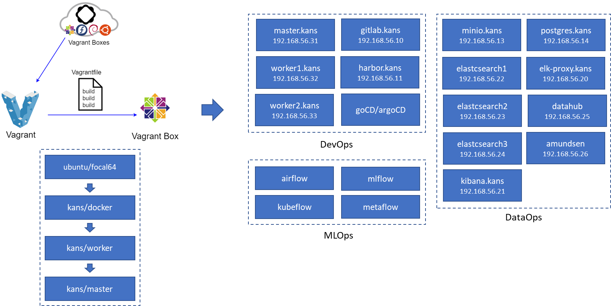
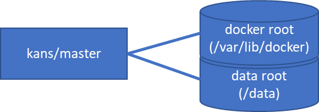

# kubernetes development experiments with multiple vagrant virtual machine

KANS 1기 종료 과제 일환으로 vagrant 를 이용해 여러 VM 을 생성하고 각종 쿠버네티스 환경을 실험하는 환경 구축을 목표로 한다.

* [KANS 1기 중간 과제](intermediate-assignment.md)

## 개요



* DevOps 개발 환경 구축 및 쿠버네티스 개발 환경 구축을 위한 다중 가상 머신 (VM, Virtual Machine) 관리 vagrant 코드.
* 네트워크 리소스 및 시간 절약을 위해 custom vagrant box 를 생성해서 사용.
* 쿠버네티스 환경 구축 실험 이나 DevOps/MLOps 오픈 소스 실험에 적합하도록 개발.
* KANS 1기 스터디 실습에 사용된 vagrantfile 을 참고해서 개발.

## persistent disks

* VM 이 실행되면 docker image 와 disk 가 저장되는 /var/lib/docker 디스크를 생성하고 마운트
* /data 디스크를 생성해서 gitlab, minio 등의 서비스 데이터가 저장될 수 있도록 디스크를 마운트



## vagrant box

* Vagrantfile
  * yaml 파일에서 provision 을 읽어서 VM 생성

```ruby
# -*- mode: ruby -*-
# vi: set ft=ruby :

require 'yaml'

# open config yaml
filename = "docker.yaml"
filename = ENV["CONFIG"] if ENV.has_key?("CONFIG")

puts "Config Filename: #{filename}"
spec = YAML.load_file(filename)["spec"]

# setup path
$setup_path = File.expand_path(spec["setup"]["host_path"])

# vagrant configure
Vagrant.configure("2") do |config|
  config.vagrant.plugins = ["vagrant-disksize"]

  config.vm.define spec["name"] do |cfg|
    cfg.vm.box = spec["box"]["name"]
    cfg.vm.box_url = spec["box"]["url"] if spec["box"].has_key?("url")
    cfg.vm.box_version = spec["box"]["version"] if spec["box"].has_key?("version")

    cfg.vm.provider :virtualbox do |vb|
      vb.customize ["modifyvm", :id, "--nicpromisc2", "allow-all"]

      # additional vm information
      if spec.has_key?("vminfo")
        vb.customize ["modifyvm", :id, "--vram", spec['vminfo']['vram']]
        vb.customize ["modifyvm", :id, "--monitorcount", spec['vminfo']['monitorcount']]
      end

      vb.name = spec["provider"]["name"]
      vb.gui = false
      vb.cpus = spec["provider"]["cpus"]
      vb.memory = spec["provider"]["memory"]
      vb.linked_clone = true
    end

    cfg.vm.hostname = spec["hostname"]

    # ssh
    if spec.has_key?("ssh")
      cfg.ssh.username = spec["ssh"]["username"]
      cfg.ssh.password = spec["ssh"]["password"]
      cfg.ssh.keys_only = false
      cfg.ssh.insert_key = false
    end

    cfg.disksize.size = spec["disk_size"]
    cfg.vbguest.auto_update = false

    # setup & skel
    puts "setup & skel"
    cfg.vm.provision "file", source: "#{$setup_path}", destination: "/tmp/setup"

    cfg.vm.provision "shell", privileged: true, inline: <<-SHELL
      rsync -av /tmp/setup/ #{spec['setup']['guest_path']}/
      chmod -R +x #{spec['setup']['guest_path']}
      cp #{spec['setup']['guest_path']}/bin/* /usr/local/bin/
      rm -rf /tmp/setup
    SHELL

    # provision
    puts "provision"
    spec['provision'].each do |item|
      item["args"] = [] if item.has_key?("args") == false
      item["reboot"] = false if item.has_key?("reboot") == false

      # path
      if item.has_key?("path")
        cfg.vm.provision "shell", privileged: true, reboot: item["reboot"],
          path: "#{$setup_path}/#{item['path']}", args: item["args"]
        next
      end

      # inline
      if item["privileged"] == true
        cfg.vm.provision "shell", privileged: true, reboot: item["reboot"], inline: item["inline"]
        next
      end

      cfg.vm.provision "shell", privileged: true, reboot: item["reboot"], inline: <<-SHELL
        sudo -H -u #{item["username"]} bash -c #{item["inline"]}
      SHELL
    end

  end
end
```

* [docker.yaml](vagrant/boxes/docker.yaml)
  * box: 베이스 이미지 정보
  * setup: 설치에 필요한 코드를 /usr/local/bin/setup 에 저장
  * provider: VM 하드웨어 스펙 정의
  * provision: VM 생성 코드 실행

```yaml
---
spec:
  name: kans-docker
  box:
    name: ubuntu/focal64
    version: 20220308.0.0
    url: https://app.vagrantup.com/ubuntu/boxes/focal64
  setup:
    host_path: ../setup
    guest_path: /usr/local/bin/setup
  provider:
    name: kans-docker
    cpus: 4
    memory: 4096
  hostname: docker
  disk_size: 45GB
  provision:
    - privileged: true
      inline: "cat /usr/local/bin/setup/config/skel/profile >> /etc/profile"
    - privileged: true
      path: "core/user-passwd.sh"
      args: ["ubuntu", "ubuntu"]
    - privileged: true
      path: "ssh/ssh-keygen.sh"
      args: ["/usr/local/bin/setup/config/.ssh"]
    - privileged: true
      path: "ssh/sshd-config.sh"
    - privileged: true
      path: "core/apt-mirror.sh"
    - privileged: true
      path: "core/focal-core.sh"
    - privileged: true
      reboot: true
      path: "core/upgrade-kernel.sh"
    - privileged: true
      path: "docker/docker-core.sh"
      args: ["5:20.10.12~3-0~ubuntu-focal"]
    - privileged: true
      path: "docker/docker-config.sh"
      args: ["10.10.0.1/16", "10.11.0.1/16"]
    - privileged: true
      path: "certs/root-certs.sh"
      args: ["mlops", "/usr/local/bin/setup/config/certs"]
    - privileged: false
      username: ubuntu
      inline: "/usr/local/bin/setup/ssh/ssh-keygen.sh"
      args: ["/usr/local/bin/setup/config/.ssh"]
    - privileged: false
      username: ubuntu
      inline: "/usr/local/bin/setup/core/oh-my-zsh.sh"
    - privileged: true
      path: "core/clear-cache.sh"
    - privileged: true
      path: "core/compact-disk.sh"
```

* [worker.yaml](vagrant/boxes/worker.yaml)
  * kubernetes 설치
* [master.yaml](vagrant/boxes/master.yaml)
  * k9s, zsh, stern 등의 kubernetes 유틸 설치

## vagrant box build

* 환경 변수에 box 생성 설정 정보를 설정후 VM 생성
* 생성된 VM 을 package 로 저장

```shell
Set-Item -Path Env:CONFIG -Value "docker.yaml"
Get-Item -Path Env:CONFIG

vagrant up

vagrant package --output "docker.box"
```

## multiple virtual machine management

* [vagrantfile](vagrant/Vagrantfile)

```ruby
# -*- mode: ruby -*-
# vi: set ft=ruby :

require 'yaml'

# make /etc/hosts
$hosts = <<-LINES
cat <<EOF | tee /etc/hosts
127.0.0.1       localhost

fe00::0 ip6-localnet
ff00::0 ip6-mcastprefix
ff02::1 ip6-allnodes
ff02::2 ip6-allrouters
ff02::3 ip6-allhosts

LINES

Dir.glob("*.yaml").each do |filename|
  $sp = YAML.load_file(filename)["spec"]
  next if $sp.has_key?("node_list") == false

  $sp["node_list"].each do |node|
    $hosts.concat("#{node['private_network']}\t#{node['hostname']}\n")
  end
end
$hosts.concat("EOF\n")

# open config yaml
filename = "kubernetes.yaml"
filename = ENV["CONFIG"] if ENV.has_key?("CONFIG")

puts "Config Filename: #{filename}"
spec = YAML.load_file(filename)["spec"]

# setup path
$setup = spec["setup"]
$setup_path = File.expand_path($setup["host_path"])

# create disk
spec["node_list"].each do |node|
  # check enable flag
  next if node["enable"] == false or node.has_key?("disk") == false

  node['disk'].each do |disk|
    filename = File.expand_path(disk['filename'])
    next if File.exist?(filename)

    puts "Create Disk: #{filename}"
    puts `VBoxManage createmedium disk --format VDI --variant Standard --size #{disk['size'] * 1024} --filename #{filename}`
  end
end

# vagrant configure
Vagrant.configure("2") do |config|
  spec["node_list"].each do |node|
    # check enable flag
    next if node["enable"] == false

    config.vm.define node["name"] do |cfg|
      cfg.vm.box = node["box"]["name"]
      cfg.vm.box_url = node["box"]["url"] if node["box"].has_key?("url")
      cfg.vm.box_version = node["box"]["version"] if node["box"].has_key?("version")

      # disk
      if node.has_key?("disk") == true
        # detach disk
        cfg.trigger.before [:destroy, :package] do |trigger|
          trigger.ruby do |env, machine|
            node["disk"].each do |hdd|
              next if machine.id == nil

              filename = File.expand_path(hdd['filename'])

              puts "Poweroff: [#{machine.id}] #{filename}"
              puts `VBoxManage controlvm #{machine.id} poweroff`

              puts "Detach Disk: [#{machine.id}] #{filename}"
              puts `VBoxManage storageattach #{machine.id} --storagectl #{hdd['storagectl']} --device 0 --port #{hdd['port']} --medium none`
            end
          end
        end
      end

      # provider
      cfg.vm.provider :virtualbox do |vb|
        vb.customize ["modifyvm", :id, "--groups", node["group_name"]]
        vb.customize ["modifyvm", :id, "--nicpromisc2", "allow-all"]

        # additional vm information
        if node.has_key?("vminfo")
          vb.customize ["modifyvm", :id, "--vram", node['vminfo']['vram']]
          vb.customize ["modifyvm", :id, "--monitorcount", node['vminfo']['monitorcount']]
        end

        # attach disk
        if node.has_key?("disk") == true
          node["disk"].each do |hdd|
            filename = File.expand_path(hdd['filename'])
            next unless File.exist?(filename)

            vb.customize ['storageattach', :id, '--storagectl', hdd["storagectl"], '--device', 0,
              '--port', hdd["port"], '--type', 'hdd', '--medium', filename]
          end
        end

        vb.name = node["name"]
        vb.gui = false
        vb.cpus = node["resources"]["cpus"]
        vb.memory = node["resources"]["memory"]
        vb.linked_clone = true
      end

      cfg.vm.hostname = node["hostname"]

      # ssh
      if spec.has_key?("ssh")
        cfg.ssh.username = spec["ssh"]["username"]
        cfg.ssh.password = spec["ssh"]["password"]
        cfg.ssh.keys_only = false
        cfg.ssh.insert_key = false
      end

      # vbguest update
      if node.has_key?("vbguest_update")
        cfg.vbguest.auto_update = node["vbguest_update"]
      end

      # synced folder
      if spec.has_key?("vbox") and spec["vbox"].has_key?("synced_folder")
        spec["vbox"]['synced_folder'].each do |folder|
          cfg.vm.synced_folder File.expand_path(folder["host_path"]), folder["guest_path"], disabled: folder["disabled"]
        end
      end

      # network
      if node.has_key?("private_network")
        cfg.vm.network "private_network", auto_correct: true, ip: node["private_network"], id: "private"
      end

      if node.has_key?("forwarded_port")
        node['forwarded_port'].each do |port|
          cfg.vm.network "forwarded_port", auto_correct: true, host: port["host"], guest: port["guest"], id: "fp-#{port['guest']}"
        end
      end

      # update setup & skel
      cfg.vm.provision "file", source: $setup_path, destination: "/tmp/setup"

      cfg.vm.provision "shell", privileged: true, inline: <<-SHELL
        rsync -av /tmp/setup/ #{$setup['guest_path']}/
        chmod -R +x #{$setup['guest_path']}
        cp #{spec['setup']['guest_path']}/bin/* /usr/local/bin/
        rm -rf /tmp/setup
      SHELL

      # update /etc/hosts``
      cfg.vm.provision "shell", privileged: true, inline: $hosts

      # format disk
      if node.has_key?("disk") == true
        node["disk"].each do |hdd|
          next unless hdd.has_key?("device")

          cfg.vm.provision "shell", privileged: true, path: "#{$setup_path}/core/disk-format.sh", args: [hdd["device"]]
          cfg.vm.provision "shell", privileged: true, path: "#{$setup_path}/core/disk-mount.sh",
            args: [hdd["device"], hdd["mount"], spec["ssh"]["username"]]
        end
      end

      # provision
      if node.has_key?("provision")
        node['provision'].each do |item|
          cfg.vm.provision "shell", privileged: item["privileged"], inline: item["inline"]
        end
      end

    end

  end
end
```

* [kubernetes yaml](vagrant/cilium.yaml)
  * box 정보와 같이 자주 바뀔수 있는 정보는 yaml anchor로 설정
  * node_list: 개별 노드 스펙 및 provision 정보 정의

```yaml
---
# box info
master_box_name: &master_box_name kans/master
master_box_url: &master_box_url file://C:/KANS/vagrant/boxes/master.json
master_box_version: &master_box_version 20220311.0.0

worker_box_name: &worker_box_name kans/worker
worker_box_url: &worker_box_url file://C:/KANS/vagrant/boxes/worker.json
worker_box_version: &worker_box_version 20220311.0.0

# spec
spec:
  setup:
    host_path: setup
    guest_path: /usr/local/bin/setup
  vbox:
    synced_folder:
      - disabled: false
        host_path: ~/workspace
        guest_path: /share
      - disabled: false
        host_path: .
        guest_path: /vagrant
  ssh:
    username: ubuntu
    password: ubuntu
  node_list:
    # kubernetes
    - name: worker1
      group_name: /kans
      enable: true
      hostname: worker1.mlops
      box:
        name: *worker_box_name
        url: *worker_box_url
        version: *worker_box_version
      private_network: 192.168.56.32
      resources:
        cpus: 6
        memory: 6144
      vbguest_update: false
      disk:
        - name: worker1-docker
          storagectl: SCSI
          port: 2
          size: 50
          filename: ./disks/worker1-docker.vdi
          device: /dev/sdc
          mount: /var/lib/docker
      provision:
        - privileged: true
          inline: "systemctl restart docker"
        - privileged: true
          inline: "update-kubelet-extra-args.sh 192.168.56.32"
    - name: worker2
      group_name: /kans
      enable: true
      hostname: worker2.mlops
      box:
        name: *worker_box_name
        url: *worker_box_url
        version: *worker_box_version
      private_network: 192.168.56.33
      resources:
        cpus: 6
        memory: 6144
      vbguest_update: false
      disk:
        - name: worker2-docker
          storagectl: SCSI
          port: 2
          size: 50
          filename: ./disks/worker2-docker.vdi
          device: /dev/sdc
          mount: /var/lib/docker
      provision:
        - privileged: true
          inline: "systemctl restart docker"
        - privileged: true
          inline: "update-kubelet-extra-args.sh 192.168.56.33"
    - name: master
      group_name: /kans
      enable: true
      hostname: master.mlops
      box:
        name: *master_box_name
        url: *master_box_url
        version: *master_box_version
      private_network: 192.168.56.31
      resources:
        cpus: 8
        memory: 8192
      vbguest_update: false
      provision:
        - privileged: true
          inline: "systemctl restart docker"
        - privileged: true
          inline: "update-kubelet-extra-args.sh 192.168.56.31"
        # kubeadm init with cilium: disable-kube-proxy
        - privileged: true
          inline: "kubernetes-init.sh 192.168.56.31 10.50.0.0/16 10.244.0.0/16 dev ubuntu disable-kube-proxy"
        - privileged: true
          inline: "apply-cilium.sh 1.11.2 192.168.56.31 192.168.56.0/16"
        # join worker
        - privileged: true
          inline: "kubernetes-join.sh worker1.mlops,worker2.mlops"
        # metrics server
        - privileged: true
          inline: "apply-metrics-server.sh /usr/local/bin/setup/config/skel"
        # LoadBalancer: metallb
        - privileged: true
          inline: "apply-metallb.sh v0.12 /usr/local/bin/setup/config/skel 192.168.56.31-192.168.56.33"
        # argocd
        - privileged: true
          inline: "apply-argocd.sh /usr/local/bin/setup/config/skel"
      disk:
        - name: master-docker
          storagectl: SCSI
          port: 2
          size: 50
          filename: ./disks/master-docker.vdi
          device: /dev/sdc
          mount: /var/lib/docker
```

## kubernetes development

```shell
Set-Item -Path Env:CONFIG -Value "calico-istio.yaml"
Get-Item -Path Env:CONFIG

vagrant up

ssh master.kans
```

## vagrant issue

* [vagrant 구동 시 오류 (Your VM has become inaccessible)](https://lng1982.tistory.com/293)
* yaml 파일로 box 생성한 이미지는 삭제시 아래와 같이 Vagrantfile 에러가 남
  * boxes 가 생성된 위치에서 삭제하거나 vagrant box 가 저장된 위치를 삭제 해야함

```shell
❯ vagrant up

❯ vagrant global-status
Config Filename: dev.yaml
There was an error loading a Vagrantfile. The file being loaded
and the error message are shown below. This is usually caused by
an invalid or undefined variable.

Path: C:/Vagrant/embedded/gems/2.2.19/gems/vagrant-2.2.19/plugins/kernel_v2/config/vm.rb
Line number: 0
Message: undefined method 'to_sym'

❯ vagrant box remove kans/master
Config Filename: istio.yaml
Removing box 'kubernetes/master' (v20220305.0.0) with provider 'virtualbox'...

❯ vagrant box remove kans/worker
Config Filename: istio.yaml
There was an error loading a Vagrantfile. The file being loaded
and the error message are shown below. This is usually caused by
an invalid or undefined variable.

Path: C:/Vagrant/embedded/gems/2.2.19/gems/vagrant-2.2.19/plugins/kernel_v2/config/vm.rb
Line number: 0
Message: undefined method 'to_sym'

❯ vagrant global-status --prune
Config Filename: docker.yaml
There was an error loading a Vagrantfile. The file being loaded
and the error message are shown below. This is usually caused by
a syntax error.

Path: C:/KANS/vagrant/Vagrantfile
Line number: 41
Message: NoMethodError: undefined method 'each' for nil:NilClass
```
